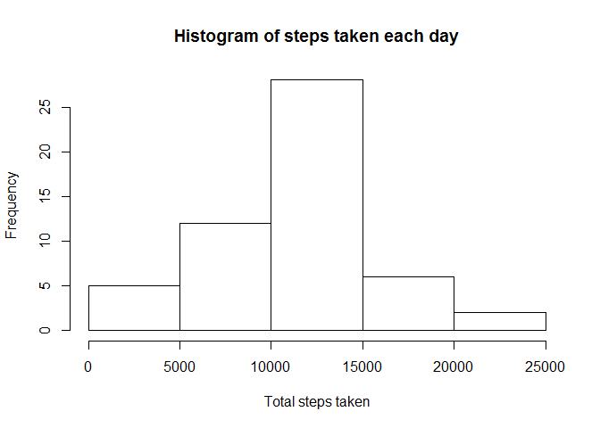
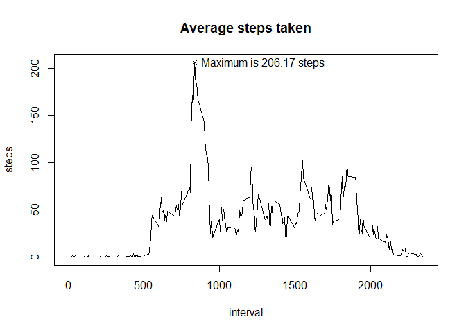
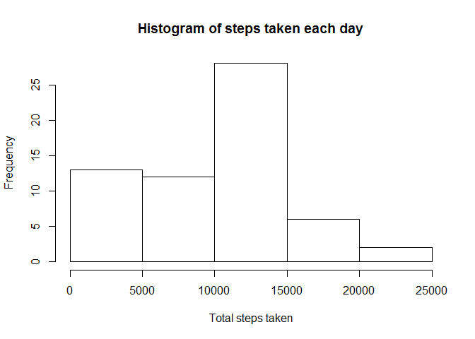
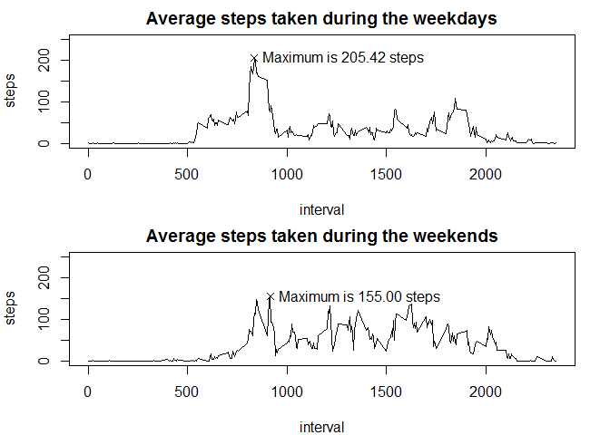

# Reproducible Research: Peer Assessment 1


## Loading and preprocessing the data
The zipped file is unzipped and the delimted data is read in using the following code:


```r
unzip("activity.zip")
data.original <- read.csv("activity.csv")
data <- na.omit(data.original)
```

Note that the rows containing NAs have been removed from the *data* data frame 
as they do not contribute to the first stages of the project. The data with the
NAs has been stored in the data frame *data.original*.


## What is mean total number of steps taken per day?
First the number of steps is aggregated over the days as below:


```r
steps_by_day <- aggregate(steps ~ date, data = data, sum)
```

The result can be seen in the following histogram:


```r
hist(steps_by_day$steps, xlab = "Total steps taken", 
     main = "Histogram of steps taken each day")
```

 

It should be noted that this excludes some days where no results were recorded.

The mean and median were calculated as follows:


```r
mean(steps_by_day$steps)
```

```
## [1] 10766.19
```

```r
median(steps_by_day$steps)
```

```
## [1] 10765
```


## What is the average daily activity pattern?

A similar analysis can be applied to interval rather than day, obtaining a graph
of the mean as follows:


```r
steps_by_interval <- aggregate(steps ~ interval, data = data, mean)
```


```r
# Get the maximum steps and interval
max_steps <- max(steps_by_interval$steps)
max_interval <- steps_by_interval$interval[which.max(steps_by_interval$steps)]

# Plot the data
plot(steps_by_interval, type = 'l', main = "Average steps taken")

# Show the maximum
points(x = max_interval, y = max_steps,pch = 4)
text(max_interval, max_steps, c(sprintf("Maximum is %.2f steps", max_steps)), 
     pos = 4)
```

 

The maximum number of steps on average across all the days measured occurs at
the interval labelled:

```r
steps_by_interval$interval[which.max(steps_by_interval$steps)]
```

```
## [1] 835
```


## Imputing missing values
As described previously, there were a number of missing observations. These
were removed from the set labelled *data*, but are included in *data.original*.
The total number of missing values is:


```r
sum(is.na(data.original))
```

```
## [1] 2304
```

We can see that this is equal to the number of rows containing missing
observations by comparing this to the difference in length between the data 
frames:


```r
length(data.original$steps) - length(data$steps)
```

```
## [1] 2304
```

A number of these missing elements can be seen at the start of the data frame:

```r
head(data.original)
```

```
##   steps       date interval
## 1    NA 2012-10-01        0
## 2    NA 2012-10-01        5
## 3    NA 2012-10-01       10
## 4    NA 2012-10-01       15
## 5    NA 2012-10-01       20
## 6    NA 2012-10-01       25
```

Further, we can fill in these missing values using the median by interval:


```r
data.interp <- data.original
fn <- function(a) median(data[data$interval == a, "steps"]) 
data.interp[is.na(data.interp), "steps"] <- 
    sapply(data.original[is.na(data.original), "interval"], fn)
head(data.interp)
```

```
##   steps       date interval
## 1     0 2012-10-01        0
## 2     0 2012-10-01        5
## 3     0 2012-10-01       10
## 4     0 2012-10-01       15
## 5     0 2012-10-01       20
## 6     0 2012-10-01       25
```

The histogram of the total number of steps take each day with the replaced
values will be:


```r
steps_by_day.interp <- aggregate(steps ~ date, data = data.interp, sum)
hist(steps_by_day.interp$steps, xlab = "Total steps taken", 
     main = "Histogram of steps taken each day")
```

 

This demonstrates a significant shift to the left as born out by the median and
mean:


```r
mean(steps_by_day.interp$steps)
```

```
## [1] 9503.869
```

```r
median(steps_by_day.interp$steps)
```

```
## [1] 10395
```

The median has dropped and the mean has dropped even more. This may indicate a
confounding variable not accomodated in the interpolation used, such as the
day of the week.


## Are there differences in activity patterns between weekdays and weekends?

The examination can be extended to consider the day of the week and whether it
is a weekend or not:

```r
data.interp$day_of_week <- weekdays(as.Date(data.interp$date))
data.interp$weekend <- "weekday"
data.interp$weekend[data.interp$day_of_week %in% c("Saturday", "Sunday")] <- 
    "weekend"
```

This data can be seperated:


```r
weekday_by_interval <- aggregate(steps ~ interval, 
                                 data = data.interp[data.interp$weekend == 
                                                        "weekday", ], 
                                 mean)

weekend_by_interval <- aggregate(steps ~ interval, 
                                 data = data.interp[data.interp$weekend == 
                                                        "weekend", ], 
                                 mean)
```

The seperated data is plotted as below:


```r
# Get the maximum steps and interval
weekday_max_steps <- max(weekday_by_interval$steps)
weekday_max_interval <- 
    weekday_by_interval$interval[which.max(weekday_by_interval$steps)]

weekend_max_steps <- max(weekend_by_interval$steps)
weekend_max_interval <- 
    weekend_by_interval$interval[which.max(weekend_by_interval$steps)]

# Plot the weekday with maximum
par(mfrow = c(2, 1), mar = c(4, 4, 2, 2))
plot(weekday_by_interval, type = 'l',
     xlab = "interval",     
     ylim = c(0, 250),
     main = "Average steps taken during the weekdays")
points(x = weekday_max_interval, y = weekday_max_steps,pch = 4)
text(weekday_max_interval, weekday_max_steps, 
     c(sprintf("Maximum is %.2f steps", weekday_max_steps)), 
     pos = 4)

# Plot the weekend with maximum
plot(weekend_by_interval, type = 'l',
     xlab = "interval",
     ylim = c(0, 250),
     main = "Average steps taken during the weekends")
points(x = weekend_max_interval, y = weekend_max_steps,pch = 4)
text(weekend_max_interval, weekend_max_steps, 
     c(sprintf("Maximum is %.2f steps", weekend_max_steps)), 
     pos = 4)
```

 

Other plotting systems are more compact, but this approach was used for
consistency. It shows that the distributions appear correlated but different.
